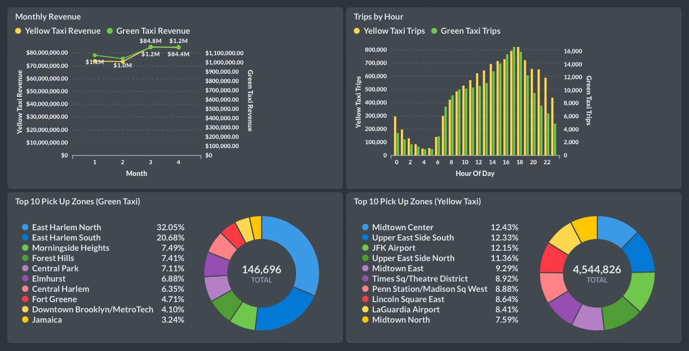

# NYC Taxi ELT Pipeline

## Prerequisites:
### AWS:
### Snowflake:
#### Snowflake System Setup Notebook:
```
USE ROLE SECURITYADMIN;

CREATE OR REPLACE ROLE dbt_DEV_ROLE COMMENT='dbt_DEV_ROLE';
GRANT ROLE dbt_DEV_ROLE TO ROLE SYSADMIN;

CREATE OR REPLACE USER dbt_USER PASSWORD='dhj=n"&N7xsUH6De'
	DEFAULT_ROLE=dbt_DEV_ROLE
	DEFAULT_WAREHOUSE=dbt_WH
	COMMENT='dbt User';
    
GRANT ROLE dbt_DEV_ROLE TO USER dbt_USER;

-- Grant privileges to role
USE ROLE ACCOUNTADMIN;

GRANT CREATE DATABASE ON ACCOUNT TO ROLE dbt_DEV_ROLE;

/*---------------------------------------------------------------------------
Next we will create a virtual warehouse that will be used
---------------------------------------------------------------------------*/
USE ROLE SYSADMIN;

--Create Warehouse for dbt work
CREATE OR REPLACE WAREHOUSE dbt_DEV_WH
  WITH WAREHOUSE_SIZE = 'SMALL'
  AUTO_SUSPEND = 120
  AUTO_RESUME = true
  INITIALLY_SUSPENDED = TRUE;

GRANT ALL ON WAREHOUSE dbt_DEV_WH TO ROLE dbt_DEV_ROLE;
USE ROLE dbt_DEV_ROLE;

CREATE OR REPLACE DATABASE dbt_DEV_DB;
GRANT ALL ON DATABASE dbt_DEV_DB TO ROLE dbt_DEV_ROLE;

USE ROLE ACCOUNTADMIN;

CREATE OR REPLACE STORAGE INTEGRATION s3_int
  TYPE = EXTERNAL_STAGE
  STORAGE_PROVIDER = 'S3'
  ENABLED = TRUE
  STORAGE_AWS_ROLE_ARN = 'arn:aws:iam::767397842695:role/MySnowflakeRole'
  STORAGE_ALLOWED_LOCATIONS = ('s3://snowflake-data-engineering-bucket/');

DESC INTEGRATION s3_int;

GRANT USAGE ON INTEGRATION s3_int TO ROLE dbt_dev_role;

CREATE OR REPLACE FILE FORMAT my_parquet_format
  TYPE = 'PARQUET'

CREATE OR REPLACE FILE FORMAT my_csv_format
    TYPE = 'CSV'
    FIELD_DELIMITER = ','
    COMPRESSION = 'AUTO'
    SKIP_HEADER = 1;


GRANT USAGE ON FILE FORMAT my_parquet_format TO ROLE dbt_dev_role;
GRANT USAGE ON FILE FORMAT my_csv_format TO ROLE dbt_dev_role;
```
#### Project Setup Notebook:
```
USE ROLE dbt_dev_role;

USE WAREHOUSE dbt_dev_wh;

CREATE OR REPLACE SCHEMA DBT_DEV_DB.nyc_taxi_schema;

CREATE OR REPLACE STAGE DBT_DEV_DB.NYC_TAXI_SCHEMA.YELLOW_TRIPDATA
  STORAGE_INTEGRATION = s3_int
  URL = 's3://snowflake-data-engineering-bucket/nyc_taxi/raw/yellow_tripdata'
  FILE_FORMAT = my_parquet_format;

CREATE OR REPLACE STAGE DBT_DEV_DB.NYC_TAXI_SCHEMA.GREEN_TRIPDATA
  STORAGE_INTEGRATION = s3_int
  URL = 's3://snowflake-data-engineering-bucket/nyc_taxi/raw/green_tripdata'
  FILE_FORMAT = my_parquet_format;


CREATE OR REPLACE TABLE DBT_DEV_DB.NYC_TAXI_SCHEMA.TAXI_ZONE_LOOKUP (
    LocationID INT,
    Borough VARCHAR(15),
    Zone VARCHAR(50),
    service_zone VARCHAR(15)
)

UPDATE DBT_DEV_DB.NYC_TAXI_SCHEMA.TAXI_ZONE_LOOKUP
SET 
    BOROUGH = LTRIM(RTRIM(BOROUGH, '"'), '"'),
    ZONE = LTRIM(RTRIM(ZONE, '"'), '"'),
    SERVICE_ZONE = LTRIM(RTRIM(SERVICE_ZONE, '"'), '"')


CREATE OR REPLACE EXTERNAL TABLE DBT_DEV_DB.NYC_TAXI_SCHEMA.yellow_tripdata_ext (
    vendorID INT AS (value:VendorID::INT),
    tpep_pickup_datetime TIMESTAMP_NTZ AS to_timestamp_ntz((value:tpep_pickup_datetime::VARCHAR)),
    tpep_dropoff_datetime TIMESTAMP_NTZ AS to_timestamp_ntz((value:tpep_dropoff_datetime::VARCHAR)),
    trip_distance FLOAT AS (value:trip_distance::FLOAT),
    PULocationID INT AS (value:PULocationID::INT),
    DOLocationID INT AS (value:DOLocationID::INT),
    passenger_count INT AS (value:passenger_count::INT),
    ratecodeID INT AS (value:RatecodeID::INT),
    store_and_fwd_flag BOOLEAN AS to_boolean((value:store_and_fwd_flag::VARCHAR)),
    payment_type INT AS (value:payment_type::INT),
    fare_amount FLOAT AS (value:fare_amount::FLOAT),
    extra FLOAT AS (value:extra::FLOAT),
    mta_tax FLOAT AS (value:mta_tax::FLOAT),
    improvement_surcharge FLOAT AS (value:improvement_surcharge::FLOAT),
    tip_amount FLOAT AS (value:tip_amount::FLOAT),
    tolls_amount FLOAT AS (value:tolls_amount::FLOAT),
    total_amount FLOAT AS (value:total_amount::FLOAT),
    congestion_surcharge FLOAT AS (value:congestion_surcharge::FLOAT),
    airport_fee FLOAT AS (value:airport_fee::FLOAT)
)
LOCATION = @YELLOW_TRIPDATA
FILE_FORMAT = my_parquet_format
AUTO_REFRESH = TRUE;

CREATE OR REPLACE EXTERNAL TABLE DBT_DEV_DB.NYC_TAXI_SCHEMA.green_tripdata_ext (
    vendorID INT AS (value:VendorID::INT),
    lpep_pickup_datetime TIMESTAMP_NTZ AS to_timestamp_ntz((value:lpep_pickup_datetime::VARCHAR)),
    lpep_dropoff_datetime TIMESTAMP_NTZ AS to_timestamp_ntz((value:lpep_dropoff_datetime::VARCHAR)),
    trip_distance FLOAT AS (value:trip_distance::FLOAT),
    PULocationID INT AS (value:PULocationID::INT),
    DOLocationID INT AS (value:DOLocationID::INT),
    passenger_count INT AS (value:passenger_count::INT),
    ratecodeID INT AS (value:RatecodeID::INT),
    store_and_fwd_flag BOOLEAN AS to_boolean((value:store_and_fwd_flag::VARCHAR)),
    payment_type INT AS (value:payment_type::INT),
    fare_amount FLOAT AS (value:fare_amount::FLOAT),
    extra FLOAT AS (value:extra::FLOAT),
    mta_tax FLOAT AS (value:mta_tax::FLOAT),
    improvement_surcharge FLOAT AS (value:improvement_surcharge::FLOAT),
    tip_amount FLOAT AS (value:tip_amount::FLOAT),
    tolls_amount FLOAT AS (value:tolls_amount::FLOAT),
    total_amount FLOAT AS (value:total_amount::FLOAT),
    trip_type INT AS (value:trip_type::INT)
)
LOCATION = @GREEN_TRIPDATA
FILE_FORMAT = my_parquet_format
AUTO_REFRESH = TRUE;
```
## Metabase Dashboard:
[]